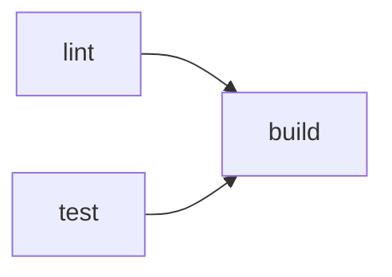

# Introduction

+ Basics
+ Workflow
+ Artifacts

# Basics

> [!NOTE]
> Workflows are place in the repository at `.github/workflows/`
> 
> Custom actions can be placed in:
> - Specific repository that contains only actions at root
> - Current repository at: `.github/actions/<custom-name>/action.yml`

```yaml
# Name of workflow
name: Workflow functionalities
# When the workflow is triggered
# workflow_dispatch - manual triggered
# Doc: https://docs.github.com/en/actions/using-workflows/events-that-trigger-workflows
on: workflow_dispatch
# Run each job in parallel by default
jobs:

# Basic functionality

  # Job name
  first-job:
    # Environment for the job to run
    # https://docs.github.com/en/actions/using-github-hosted-runners/about-github-hosted-runners/about-github-hosted-runners
    runs-on: ubuntu-latest
    # Like tasks in Ansible; simple commands
    steps:
      # Name of the step
      - name: Print greeting
        # An action (like module)
        # Run: shell command
        run: echo "Hello World!"
```

# Artifacts

```yaml
name: Artifacts
on:
  # Will trigger only when a push is made to the targeted branches
  push:
    branches: [main, master]
  creating-artifacts:
    runs-on: ubuntu-latest
    steps:
      - name: Download code
        # Runs an action defined on a github repository / local
        uses: actions/checkout@v4
	  - name: Upload artifacts
        uses: actions/upload-artifact@v4
        # 'Arguments' for the action
        with:
          # Name of artifact
          name: my-code
          # Files to be added to artifact.
          # Here will add the entire project
          path: .

  downloading-artifacts:
    # Waits for 'creating-artifacts' to finish succesfully
    # Otherwise there wouldn't be anything to download
	needs: second-job
    runs-on: ubuntu-latest
    steps:
     - name: Get build artifacts
        uses: actions/download-artifact@v4
        with:
          # Same name as upload artifacts
          name: my-code
```

# Work<ins>flow</ins>

```yml
name: Controlling the flow
on:
  # Will trigger only when a pull request is made to the targeted branches
  pull_request:
    branches: [main, master]
jobs:
# Runs in parallel with 'test'
  lint:
    runs-on: ubuntu-latest
    steps:
      - name: Download code
        # Runs an action defined on a github repository / local
        uses: actions/checkout@v4
        # Since dependencies are installed on every job
        # is a good idea to cache them to speed up the workflow
	  - name: Cache dependencies
        # Naming the step so we can recognize and use it in other places
        id: my-cache
        uses: actions/cache@v4
        # 'Arguments' for the action
        with:
          # The path to the folder/files we want to cache
          path: node_modules
          # A key that is composed of a variable
          # If package-lock file changed then it means our dependencies
          # changed and will need to reinstall them
          # Otherwise skip installatation
          key: dependency-modules-${{ hashFiles('**/package-lock.json') }}
      - name: Install dependencies
        run: npm install
        # If key changed then run this step
        if: steps.my-cache.outputs.cache-hit != 'true'
      - name: Lint code
        run: npm run lint

  # Runs in parallel with 'lint'
  test:
    runs-on: ubuntu-latest
    steps:
      - name: Get code
        uses: actions/checkout@v4
      - name: Cache dependencies
        id: my-cache
        uses: actions/cache@v4
        with:
          path: controlling-workflow/node_modules
          key: dependency-modules-${{ hashFiles('**/package-lock.json') }}
      - name: Install dependencies
        run: npm install
      - name: Test code
        # This will make the step succeed even if it failed and
        # all the jobs will continue
        # continue-on-error: true
        id: run-tests
        run: npm run test
      - name: Upload test report
        # failure() checks if previous steps failed and
        # makes actions verify the condition
        if: failure() && steps.run-tests.outcome == 'failure'
        uses: actions/upload-artifact@v4
        with:
          name: test-report
          path: controlling-workflow/test.json
  build:
    # Waits for 'lint' and 'test' to finish
    needs: [lint, test]
    . . .
```




# Strategy

## Matrix

```yml
name: Matrix
on: push
jobs:
  build:
    # Continues if job fails. Therefore the other os/node-versions will not be canceled
    continue-on-error: true
    strategy:
      matrix:
        # Will run with each combinations
        node-version: [12, 14, 16]
        operating-system: [ubuntu-latest, windows-latest]
        # Defines specific combination to run
        # Can be outside of defined matrix
        include:
          # Adds only 1 specific combination
          - node-version: 18
            operating-system: ubuntu-latest
        # Excludes specific combination so it will not run
        exclude:
          - node-version: 12
            operating-system: windows-latest
    # Runs for every operating system mentioned    
    runs-on: ${{ matrix.operating-system }}
    steps:
      - name: Get Code
        uses: actions/checkout@v4
      - name: Install NodeJS
        uses: actions/setup-node@v4
        with:
          # Runs for every mentioned version
          node-version: ${{ matrix.node-version }}
```

<details>
<summary>Combinations what will run from example</summary>
<details>
<summary>Ubuntu</summary>
+ ubuntu-latest with node v12
+ ubuntu-latest with node v14
+ ubuntu-latest with node v16
+ ubuntu-latest with node v18 - because of `include`
</details>
<details>
<summary>Windows</summary>
+ ~~windows-latest with node v12~~ - avoided because of `exclude`
+ windows-latest with node v14
+ windows-latest with node v16
+ ~~windows-latest with node v18~~ - is not defined in strategy or `include`
</details>
</details>

# Environment variables

```yml
# https://docs.github.com/en/actions/learn-github-actions/variables#default-environment-variables
name: Environment variables
on:
  push:
    branches:
      - main
      - dev
env:
  MONGODB_DB_NAME: database_demo
jobs:
  environment-variables:
    # Environment settings from GitHub repo settings -> environments
    environment: testing
    env:
      # Can add important information as secrets by configuring repository
      MONGODB_PASSWORD: ${{ secrets.MONGODB_PASSWORD }}
      PORT: 8080
    runs-on: ubuntu-latest
    steps:
      - name: Run server
        # Port will be used and printed to log
        run: npm start & npx wait-on http://127.0.0.1:$PORT
      - name: Output information
        # To access an environment variable any of these methods
        # Only DB name will be printed to log because password is set as secret
        run: | 
          echo "MONGODB_PASSWORD: ${{ env.MONGODB_PASSWORD }}"
          echo "MONGO_DB_NAME: $MONGODB_DB_NAME"
        # The last one is shell based, therefore it will not work on Windows
```

# Output information

```yml
name: Output information
on: [workflow_dispatch, issues]
jobs:
  info:
    runs-on: ubuntu-latest
    steps:
      - name: Output GitHub context
        # https://docs.github.com/en/actions/learn-github-actions/contexts
        # https://docs.github.com/en/actions/learn-github-actions/expressions
        run: echo "${{ toJson(github.event) }}"
```

# Reusable workflow

```yml
# This file is placed in .github/workflows/reusable.yml
name: Reusable workflow
# Runs when it is called
# I called it in controlling-workflow.yml
on: 
  workflow_call:
    # This can be skipped if we dont want to receive a value from the calling workflow.
    inputs:
      artifact-name:
        description: The name of deployable artifact files
        required: true
        # If required is false can use a default value
        # default: name
        type: string
    outputs:
      result:
        description: The result of deployment
        value: ${{ jobs.deploy.outputs.outcome }}
#    secrets:
#      my-secret:
#        required: false
jobs:
  deploy:
    outputs:
      outcome: ${{ steps.set-result.outputs.step-result }}
    runs-on: ubuntu-latest
    steps:
    - name: Get Code
      uses: actions/download-artifact@v4
      with:
        name: ${{ inputs.artifact-name }}
    - name: List Files
      run: tree
    - name: Output information
      run: echo "Something"
    - name: Set result output
      id: set-result
      run: echo "step-result=success" >> $GITHUB_OUTPUT
```

```yml
name: Controlling workflow
on:
  push:
    branches:
      - main
jobs:  
  deploy:
    needs: build
    # Using another workflow
    uses: ./.github/workflows/reusable.yml
    # Can also provide a value to the other workflow
    with:
      artifact-name: my-files
```
# Custom actions

> [!NOTE]
> Custom actions can be placed in `.github/actions/<action-name>/action.yml`  
> This action can be called using the path to it:  
> - `./.github/actions/<action-name>`  
>   
> It can also be placed at the root of specialized repository that only stores this actions.  
> Then it will be called by it's name:
> - `<username>/<action-name>@<version>`


```yaml
# This action is placed in .github/actions/cached-deps/action.yml
name: 'Composite Action'
description: 'This is a demo for composite action type'
inputs:
  caching:
    description: 'Turn caching on/off (default: true)'
    required: false
    default: 'true'
  run-path:
    description: 'On which working-directory the run commands will apply'
    required: false
    default: '.'
outputs:
  used-cache:
    description: 'Output if cache was used or not'
    value: ${{ steps.install.outputs.cache }}
runs:
  using: 'composite'
  steps:
    - name: Cache dependencies
      if: inputs.caching == 'true'
      id: cache
      uses: actions/cache@v4
      with:
        path: custom-actions/node_modules
        key: deps-node-modules-${{ hashFiles('**/package-lock.json') }}
    - name: Install dependencies
      if: steps.cache.outputs.cache-hit != 'true' || inputs.caching != 'true'
      id: install
      shell: bash
      working-directory: ${{ inputs.run-path }}
      run: |
        npm ci
        echo "cache='${{ inputs.caching }}'" >> $GITHUB_OUTPUT
```

```yml
name: 'Using Custom Action'
on:
  push:
    branches:
      - main
jobs:
  lint:
    runs-on: ubuntu-latest
    steps:
      - name: Get code
        uses: actions/checkout@v4
      - name: Load & cache dependencies
        id: cache-deps
        # Using inputs for composite action
        with:
          caching: 'false'
          run-path: 'custom-actions'
        # If there is another repository specialized only for actions it could be used like this
        # uses: M13X/my-action
        # Since this is a local defined action it is used like this:
        uses: ./.github/actions/cached-deps
      - name: Output information
        run: echo "Cache used? ${{ steps.cache-deps.outputs.used-cache }}"
      - name: Lint code
        run: npm run lint
    
    . . .  
```

# Workflow Messages

```yml
name: Workflow Messages
on: workflow_dispatch
jobs:
  error-messages:
    runs-on: ubuntu-latest
    steps:
      - name: Set error and anotation
        run: echo "::error::Missing semicolon"
      - name: Set error and parameters
        run: echo "::error title=Error Title,file=problem_file.py,line=10,endLine=11,col=5,encColumn=7::Missing semicolon"
  group-logs:
    runs-on: ubuntu-latest
    steps:
      - name: Create a group of logs
        run: |
          echo "::group::My group tite"
          echo "This is inside group"
          echo "and will collapse"
          echo "::endgroup::"
    group-logs:
      runs-on: ubuntu-latest
      steps:
        - name: Masking value
          run: echo "::add-mask::Secret String"
        - name: Echo secret
          run: echo "Secret String"
```

> [!NOTE]
> `error` can be replaced with the following commands:
> - debug
> - warning
> - notice