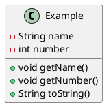

# Introduction

+ [Basic Formatting Syntax](#basic-formatting-syntax)
+ [Styling text](#styling-text)
+ [Internal Links](#internal-links)
+ [External Links](#external-links)
+ [External Images](#external-images)
+ [Quotes](#quotes)
+ [Lists](#lists)
+ [Task List](#task-list)
+ [Nesting List](#nesting-list)
+ [Table](#table)
+ [Inline Code](#inline-code)
+ [Code Blocks](#code-blocks)
+ [LaTeX](#latex)
+ [Diagrams](#diagrams)
+ [Foot Notes](#foot-notes)


---
# Basic Formatting Syntax
---
# Headings
# This is a heading 1 
## This is a heading 2 
### This is a heading 3 
#### This is a heading 4 
##### This is a heading 5 
###### This is a heading 6
---
#  Styling text 
 
| Style                  | Syntax                 | Example                                  | Output                                 |
| ---------------------- | ---------------------- | ---------------------------------------- | -------------------------------------- |
| Bold                   | `** **` or `__ __`     | `**Bold text**`                          | **Bold text**                          |
| Italic                 | `* *` or `_ _`         | `*Italic text*`                          | _Italic text_                          |
| Strikethrough          | `~~ ~~`                | `~~Striked out text~~`                   | ~~Striked out text~~                   |
| Highlight              | `== ==`                | `==Highlighted text==`                   | ==Highlighted text==                   |
| Bold and nested italic | `** **` and `_ _`      | `**Bold text and _nested italic_ text**` | **Bold text and _nested italic_ text** |
| Bold and italic        | `*** ***` or `___ ___` | `***Bold and italic text***`             | **_Bold and italic text_**             |
| Subscript              | `<sub> </sub>`         | `This is <sub>subscript</sub> text`      | This is <sub>subscript</sub> text      |
| Superscript            | `<sup> </sup>`         | `This is <sup>superscript</sup> text`    | This is <sup>superscript</sup> text    |

```markdown
> [!NOTE]
> Useful information that users should know, even when skimming content.

> [!TIP]
> Helpful advice for doing things better or more easily.

> [!IMPORTANT]
> Key information users need to know to achieve their goal.

> [!WARNING]
> Urgent info that needs immediate user attention to avoid problems.

> [!CAUTION]
> Advises about risks or negative outcomes of certain actions.
```

> [!NOTE]
> Useful information that users should know, even when skimming content.

> [!TIP]
> Helpful advice for doing things better or more easily.

> [!IMPORTANT]
> Key information users need to know to achieve their goal.

> [!WARNING]
> Urgent info that needs immediate user attention to avoid problems.

> [!CAUTION]
> Advises about risks or negative outcomes of certain actions.


---

# Internal Links

- Wikilink: `[[Three laws of motion]]`
- Markdown: `[Three laws of motion](Three%20laws%20of%20motion.md)`

---
# External Links

`[Obsidian Help](https://help.obsidian.md)`
[Obsidian Help](https://help.obsidian.md)

---
# External Images

``
``


---
# Quotes

`> Human beings face ever more complex and urgent problems, and their effectiveness in dealing with these problems is a matter that is critical to the stability and continued progress of society. \- Doug Engelbart, 1961`

> Human beings face ever more complex and urgent problems, and their effectiveness in dealing with these problems is a matter that is critical to the stability and continued progress of society. \- Doug Engelbart, 1961

---
# Lists

You can create an unordered list by adding a `-`, `*`, or `+` before the text.

```md
- First list item
* Second list item
+ Third list item
```

- First list item
* Second list item
+ Third list item

To create an ordered list, start each line with a number followed by a `.` symbol.

```md
1. First list item
2. Second list item
3. Third list item
```

1. First list item
2. Second list item
3. Third list item

---
# Task List

To create a task list, start each list item with a hyphen and space followed by `[ ]`.

```md
- [x] This is a completed task.
- [ ] This is an incomplete task.
```

- [x] This is a completed task.
- [ ] This is an incomplete task.

You can toggle a task in Reading view by selecting the checkbox.

Tip: You can use any character inside the brackets to mark it as complete.

```md
- [x] Milk
- [?] Eggs
- [-] Eggs
```

- [x] Milk
- [x] Eggs
- [x] Eggs

---
# Nesting List

To create a nested list, indent one or more list items:

```md
1. First list item
   1. Ordered nested list item
2. Second list item
   - Unordered nested list item
```

1. First list item
    1. Ordered nested list item
2. Second list item
    - Unordered nested list item

Similarly, you can create a nested task list by indenting one or more list items:

```md
- [ ] Task item 1
	- [ ] Subtask 1
- [ ] Task item 2
	- [ ] Subtask 1
```

- [ ] Task item 1
    - [ ] Subtask 1
- [ ] Task item 2
    - [ ] Subtask 1

Use `Tab` or `Shift+Tab` to indent or unindent one or more selected list items for easy organization.

---
# Table

```text
| Heading 1 | Heading 2 | Heading 3 |
| --------- | --------- | --------- |
| col 1     | col 2     | col 3     |
|           |           |           |
```

| Heading 1 | Heading 2 | Heading 3 |
| --------- | --------- | --------- |
| col 1     | col 2     | col 3     |

---
# Inline Code

You can format code within a sentence using single backticks.

```md
Text inside `backticks` on a line will be formatted like code.
```

---
# Code Blocks

To format a block of code, surround the code with triple backticks.

````
```
cd ~/Desktop
```
````

```md
cd ~/Desktop
```

You can also create a code block by indenting the text using `Tab` or 4 blank spaces.

```md
    cd ~/Desktop
```

You can add syntax highlighting to a code block, by adding a language code after the first set of backticks.

````md
```js
function fancyAlert(arg) {
  if(arg) {
    $.facebox({div:'#foo'})
  }
}
```
````

```js
function fancyAlert(arg) {
  if(arg) {
    $.facebox({div:'#foo'})
  }
}
```

---
# [[LaTeX]]


---
# Diagrams

#### Mermaid 
```mermaid 
info
```
````text

````


#### GeoJSON
````text
```geojson
{
  "type": "FeatureCollection",
  "features": [
    {
      "type": "Feature",
      "id": 1,
      "properties": {
        "ID": 0
      },
      "geometry": {
        "type": "Polygon",
        "coordinates": [
          [
              [-90,35],
              [-90,30],
              [-85,30],
              [-85,35],
              [-90,35]
          ]
        ]
      }
    }
  ]
}
```
````
```geojson
{
  "type": "FeatureCollection",
  "features": [
    {
      "type": "Feature",
      "id": 1,
      "properties": {
        "ID": 0
      },
      "geometry": {
        "type": "Polygon",
        "coordinates": [
          [
              [-90,35],
              [-90,30],
              [-85,30],
              [-85,35],
              [-90,35]
          ]
        ]
      }
    }
  ]
}
```
#### TopoJSON
````text
```topojson
{
  "type": "Topology",
  "transform": {
    "scale": [0.0005000500050005, 0.00010001000100010001],
    "translate": [100, 0]
  },
  "objects": {
    "example": {
      "type": "GeometryCollection",
      "geometries": [
        {
          "type": "Point",
          "properties": {"prop0": "value0"},
          "coordinates": [4000, 5000]
        },
        {
          "type": "LineString",
          "properties": {"prop0": "value0", "prop1": 0},
          "arcs": [0]
        },
        {
          "type": "Polygon",
          "properties": {"prop0": "value0",
            "prop1": {"this": "that"}
          },
          "arcs": [[1]]
        }
      ]
    }
  },
  "arcs": [[[4000, 0], [1999, 9999], [2000, -9999], [2000, 9999]],[[0, 0], [0, 9999], [2000, 0], [0, -9999], [-2000, 0]]]
}
```
````
```topojson
{
  "type": "Topology",
  "transform": {
    "scale": [0.0005000500050005, 0.00010001000100010001],
    "translate": [100, 0]
  },
  "objects": {
    "example": {
      "type": "GeometryCollection",
      "geometries": [
        {
          "type": "Point",
          "properties": {"prop0": "value0"},
          "coordinates": [4000, 5000]
        },
        {
          "type": "LineString",
          "properties": {"prop0": "value0", "prop1": 0},
          "arcs": [0]
        },
        {
          "type": "Polygon",
          "properties": {"prop0": "value0",
            "prop1": {"this": "that"}
          },
          "arcs": [[1]]
        }
      ]
    }
  },
  "arcs": [[[4000, 0], [1999, 9999], [2000, -9999], [2000, 9999]],[[0, 0], [0, 9999], [2000, 0], [0, -9999], [-2000, 0]]]
}
```

#### STL 3D
````text
```stl
solid cube_corner
  facet normal 0.0 -1.0 0.0
    outer loop
      vertex 0.0 0.0 0.0
      vertex 1.0 0.0 0.0
      vertex 0.0 0.0 1.0
    endloop
  endfacet
  facet normal 0.0 0.0 -1.0
    outer loop
      vertex 0.0 0.0 0.0
      vertex 0.0 1.0 0.0
      vertex 1.0 0.0 0.0
    endloop
  endfacet
  facet normal -1.0 0.0 0.0
    outer loop
      vertex 0.0 0.0 0.0
      vertex 0.0 0.0 1.0
      vertex 0.0 1.0 0.0
    endloop
  endfacet
  facet normal 0.577 0.577 0.577
    outer loop
      vertex 1.0 0.0 0.0
      vertex 0.0 1.0 0.0
      vertex 0.0 0.0 1.0
    endloop
  endfacet
endsolid
```
````
```stl
solid cube_corner
  facet normal 0.0 -1.0 0.0
    outer loop
      vertex 0.0 0.0 0.0
      vertex 1.0 0.0 0.0
      vertex 0.0 0.0 1.0
    endloop
  endfacet
  facet normal 0.0 0.0 -1.0
    outer loop
      vertex 0.0 0.0 0.0
      vertex 0.0 1.0 0.0
      vertex 1.0 0.0 0.0
    endloop
  endfacet
  facet normal -1.0 0.0 0.0
    outer loop
      vertex 0.0 0.0 0.0
      vertex 0.0 0.0 1.0
      vertex 0.0 1.0 0.0
    endloop
  endfacet
  facet normal 0.577 0.577 0.577
    outer loop
      vertex 1.0 0.0 0.0
      vertex 0.0 1.0 0.0
      vertex 0.0 0.0 1.0
    endloop
  endfacet
endsolid
```





---
# Foot Notes
You can add footnotes`[[1]](https://publish.obsidian.md/#fn-1-204a8d32c9c7228d)` to your notes using the following syntax:

```md
This is a simple footnote[^1].

[^1]: This is the referenced text.
[^2]: Add 2 spaces at the start of each new line.
  This lets you write footnotes that span multiple lines.
[^note]: Named footnotes still appear as numbers, but can make it easier to identify and link references.
```

You can also inline footnotes in a sentence. Note that the caret goes outside the brackets.

```md
You can also use inline footnotes. ^[This is an inline footnote.]
```


