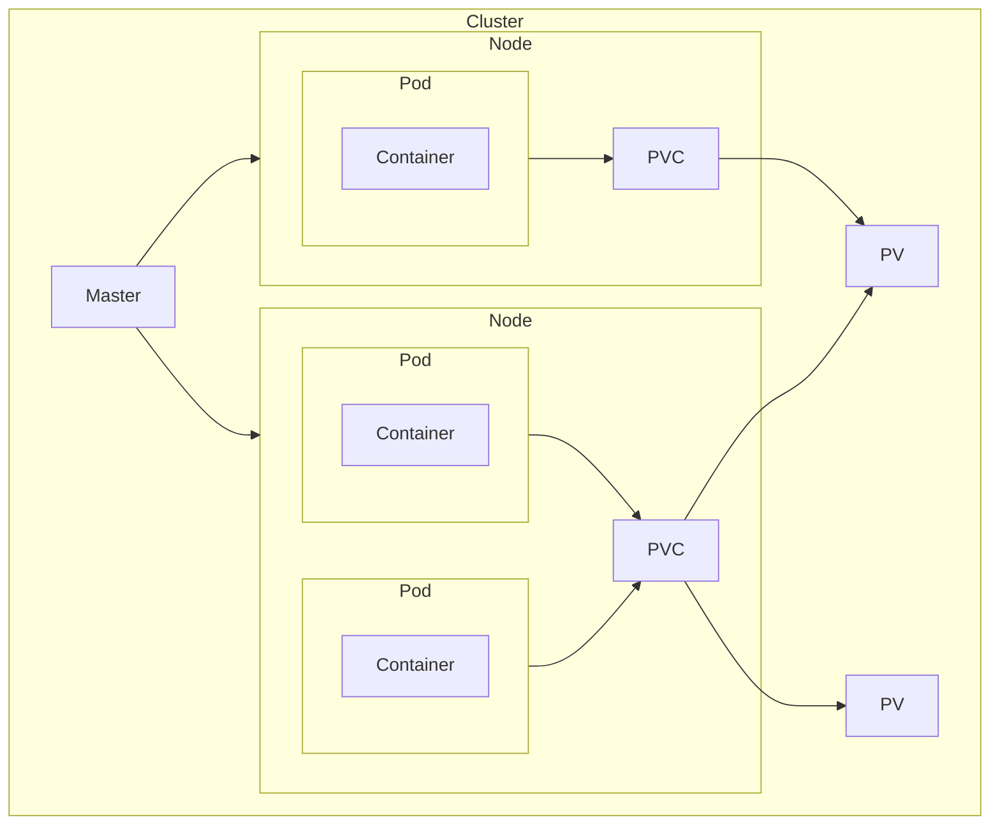

## Minikube

| Command                           | Description |
| --------------------------------- | ----------- |
| `minikube start`                  |             |
| `minikube dashboard`              |             |
| `minikube service <service-name>` |             |

## Kubectl

### Create

### Update

|                                                 |     |
| ----------------------------------------------- | --- |
| `kubectl get <option>`                          |     |
| `pods`                                          |     |
| `nodes`                                         |     |
| `deployments`                                   |     |
|                                                 |     |
|                                                 |     |
|                                                 |     |
|                                                 |     |
|                                                 |     |
|                                                 |     |
| `(services, , , pv, pvc, , namespaces, events)` |     |

kubectl expose deployment <name> --type=<service> --port=8080    service = ClusterIP, NodePort, LoadBalancer

kubectl delete <option> <name> (service, pod, deployment, pv, pvc, node, namespace, event)

kubectl scale deployment/<name> --replicas=3

Create
kubectl create deployment <name> --image=<registry>/<user>/<image>,... can add multiple images

kubectl apply -f '<file.yaml>' OR -k '<directory>' ... -f or k for multiple yaml
For update, just change the yaml and call kubectl apply again.
kubectl delete -f '<file.yaml>' OR -k '<directory>' ... -f or k for multiple yaml
kubectl delete -l <key-label>=<value-label>

Update image
kubectl set image deployment/<name> <image-name>=<new-image-name-to-pull>

kubectl rollout status deployment       Check if update was successful

kubectl rollout undo deployment/<name>     Turn back to previous deployment

kubectl rollout history deployment/<name>    See the revision ids of rollouts
kubectl rollout history deployment/<name> --revision=<revision-id>  See the history of rollouts

kubectl rollout undo deployment/<name> --to-revision=<revision-id>  Turn back selected revision

Declarative
kubectl apply –f config.yaml

kubectl cluster-info Display addresses of the master and services 