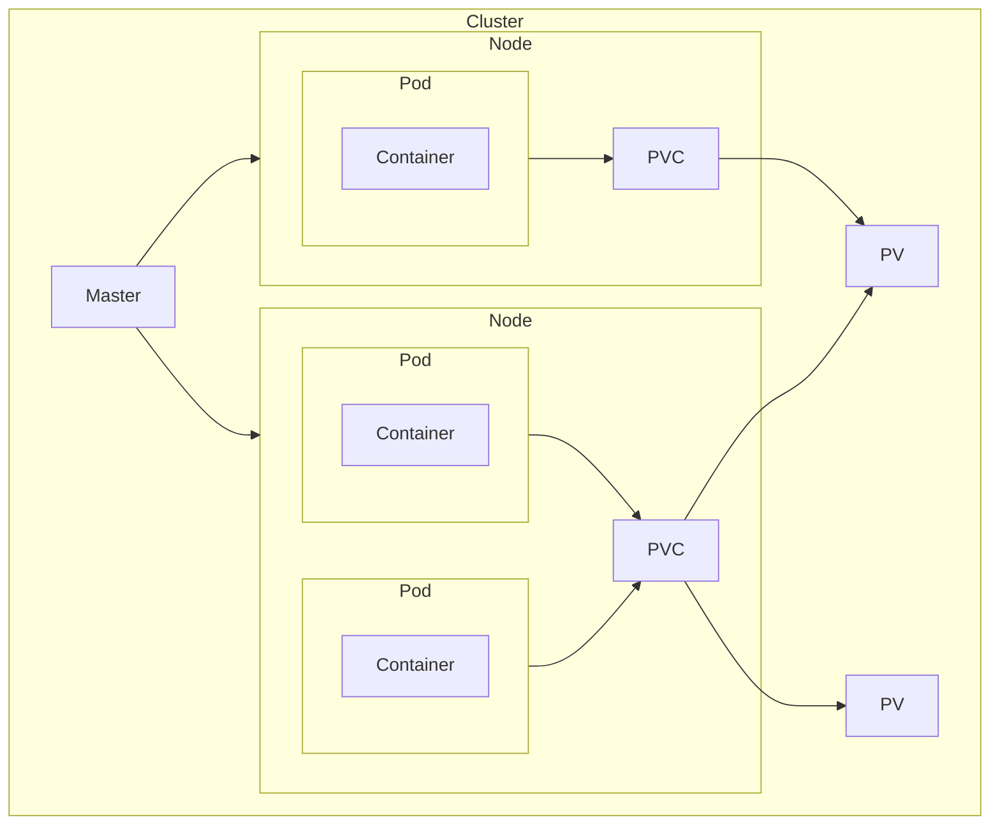

## Minikube

It's a tool that runs a single node Kubernetes cluster locally.

| Command                           | Description                                                     |
| --------------------------------- | --------------------------------------------------------------- |
| `minikube start`                  | Creates/Starts a local Kubernetes cluster                       |
| `minikube stop`                   | Stops the local Kubernetes cluster                              |
| `minikube delete`                 | Deletes the Minikube VM                                         |
| `minikube dashboard`              | Launches the Kubernetes dashboard                               |
| `minikube service <service-name>` | Accesses a Kubernetes service via the Minikube IP and port      |
| `minikube status`                 | Shows the status of the Minikube cluster and related components |

## Kubectl

### General

| Command                                  | Description                                  |
| ---------------------------------------- | -------------------------------------------- |
| `kubectl get <resource>`                 | List resources                               |
| `kubectl delete <resource> <name>`       |                                              |
| `kubectl describe <resource> <name>`<br> | Get detailed information about a resource    |
| `pods`                                   | Pods in default namespace                    |
| `nodes`                                  | Nodes in cluster                             |
| `deployments`                            | Deployments in default namespace             |
| `services`                               | Services in default namespace                |
| `pv`                                     | Permanent Volumes                            |
| `pvc`                                    | Permanent Volume Claims                      |
| `namespaces`                             | Namespaces                                   |
| `events`                                 | Events                                       |
|                                          |                                              |
| `kubectl cluster-info`                   | Display addresses of the master and services |

### Deployment

| Command                                                                     | Description                                                |
| --------------------------------------------------------------------------- | ---------------------------------------------------------- |
| `kubectl set image deployment/<name> <image-name>=<new-image-name-to-pull>` |                                                            |
| `kubectl rollout status deployment`                                         | Check if update was successful                             |
| `kubectl rollout undo deployment/<name>`                                    | Turn back to previous deployment                           |
| `kubectl rollout history deployment/<name>`                                 | See the revision ids of rollouts                           |
| `kubectl rollout history deployment/<name> --revision=<revision-id>`        | See the history of rollouts                                |
| `kubectl rollout undo deployment/<name> --to-revision=<revision-id>`        | Turn back selected revision                                |
| `kubectl scale deployment/<name> --replicas=<number>`                       | Creates clones based on number of replicas an deploys them |
| `kubectl create deployment <name> --image <registry>/<user>/<image>,... `   | Creates deployment based on specified image                |

### Pod

| Command                                 | Description                 |
| --------------------------------------- | --------------------------- |
| `kubectl logs <pod-name>`<br>           | Shows the logs of a pod     |
| `kubectl exec -it <pod-name> <command>` | Executes command inside pod |

### Network

| Network type   | Description                                                                |
| -------------- | -------------------------------------------------------------------------- |
| `ClusterIP`    | (Default) Internal access. Inter pod communication                         |
| `NodePort`     | External access. Exposes static port (30000-32767) on each node IP address |
| `LoadBalancer` | External access. Exposes service externally to host/cloud provider.        |

| Command                                                                                  | Description                                                                                    |
| ---------------------------------------------------------------------------------------- | ---------------------------------------------------------------------------------------------- |
| `kubectl expose deployment <name> --type=<service> --port=<port> service=<service_type>` | Exposes port on deployment and creates service:<br>- ClusterIP<br>- NodePort<br>- LoadBalancer |


### Declarative

| Command                                       | Description                                                   |
| --------------------------------------------- | ------------------------------------------------------------- |
| `kubectl apply –f <config>.yaml`              | Initializes and starts services according to config file      |
| `kubectl delete –f <config>.yaml`             | Stops and deletes services according to config file           |
| `kubectl delete -l <key-label>=<value-label>` | Delete a service by mentioning the key and value of its label |

### Components Overview



### YAML

```yaml
# Define the API version
apiVersion: <api_version>

# Type of resource
kind: <resource>

# Details about the resource
metadata:
  # Name of the resource
  name: <name>
  # Define a namespace for resource, otherwise will go to default
  namespace: <name>

# Specifications for configuration
spec:
  <config>
```

```yaml
apiVersion: v1
# Pod resource
kind: Pod
metadata:
  name: <pod_name>
spec:
  # Container from docker
  containers:
  - name: <container_name>
    image: <image_name>:<tag>
    ports:
    - containerPort: <port>

  volumes:
    - name: <storage_name>
      persistentVolumeClaim:
        # Must be the same name from a declared PVC to be linked together
        claimName: <pvc_name>
```

```yaml
apiVersion: apps/v1
# Deployment resource
kind: Deployment
metadata:
  name: <deployment_name>
spec:
  # How many times the resources bellow will be cloned
  replicas: <amount>
  # "Links" resources by label/expression
  selector:
    matchLabels:
      # The resources with this key and value label will be part of this deployment
      <key>: <value>
  # Makes it easy to reuse this exact configuration
  template:
    metadata:
      # Sets a label for this resource
      labels:
        <key>: <value>
    spec:
      containers:
      - name: <container_name>
        image: <image_name>:<tag>
        ports:
        - containerPort: <port>
```

```yaml
apiVersion: v1
# Service resource
kind: Service
metadata:
  name: <service_name>
spec:
  # Resources with this key+value will be part of this service
  selector:
    <key>: <value>
  ports:
    # Protocol type. Default TCP
  - protocol: <type>
    # Port from outside
    port: <port>
    # Port from inside
    targetPort: <target_port>
  # ClusterIP, NodePort, LoadBalancer
  type: <type>
```

```yaml
apiVersion: v1
# Configuration map resource
kind: ConfigMap
metadata:
  name: <config_name>
# Defines key and values. Can think about it as environment variables
data:
  <key>: <value>
```

```yaml
apiVersion: v1
# Secret resource
kind: Secret
metadata:
  name: my-secret
type: Opaque
# Used to store sensitive data
data:
  username: YWRtaW4=  # base64 encoded value
  password: MWYyZDFlMmU2N2Rm  # base64 encoded value
```

```yaml
apiVersion: v1
# Persistent Volume resource
kind: PersistentVolume
metadata:
  name: <pv_name>
spec:
  capacity:
    # Set the storage capacity for volume
    # Ei, Pi, Ti, Gi, Mi, Ki. Example: 1Gi for 1 Gigabyte
    storage: <amount>
  # Filesystem, Block
  volumeMode: <volume_mode>
  accessModes:
    # Can be used only by 1 node (read+write)
    - ReadWriteOnce
    # Can be used by multiple nodes (read only)
	- ReadOnlyMany
    # Can be used by multiple nodes (read+write)
	- ReadWriteMany
	# Can be used only by 1 pod
	- ReadWriteOncePod
  # Retain: allows for manual reclamation of the resource
  # Delete: removes both the PV object from Kubernetes and external storage
  # (Deprecated) Recycle
  persistentVolumeReclaimPolicy: <type>
  storageClassName: <storage_class>
  hostPath:
    path: /mnt/data
```

```yaml
apiVersion: v1
kind: PersistentVolumeClaim
metadata:
  name: <pvc_name>
spec:
  accessModes:
    # Described in PV
    - <access_type>
  resources:
    requests:
      # Split the storage if there are multiple claims on the same PV
      storage: <amount>
  # Must have the same class name as PV to communicate
  storageClassName: <storage_class>
```
