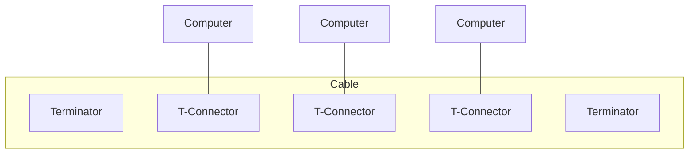
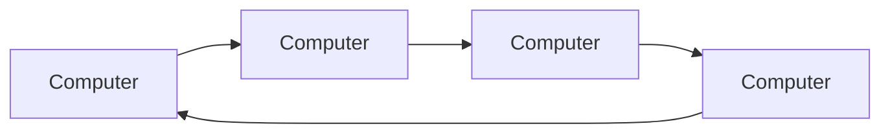
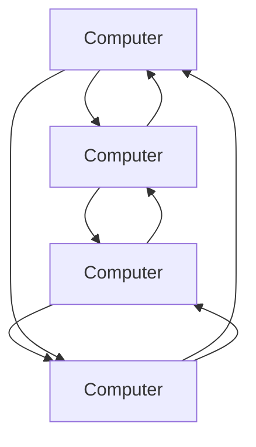
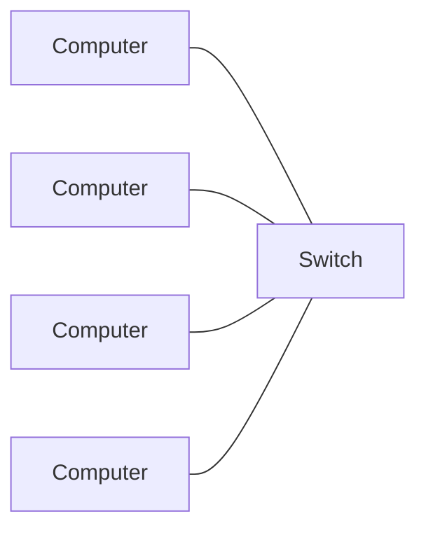
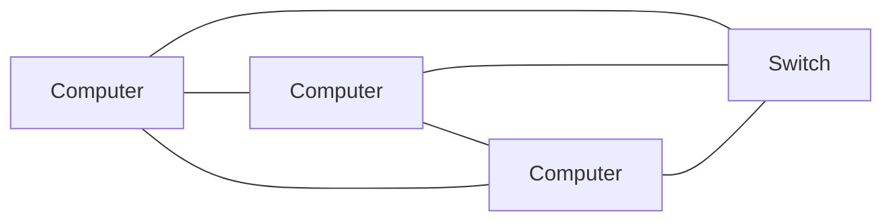
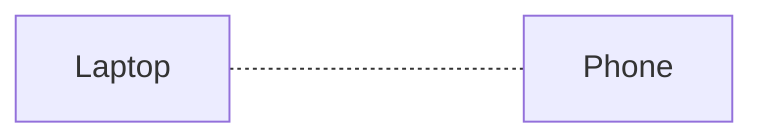
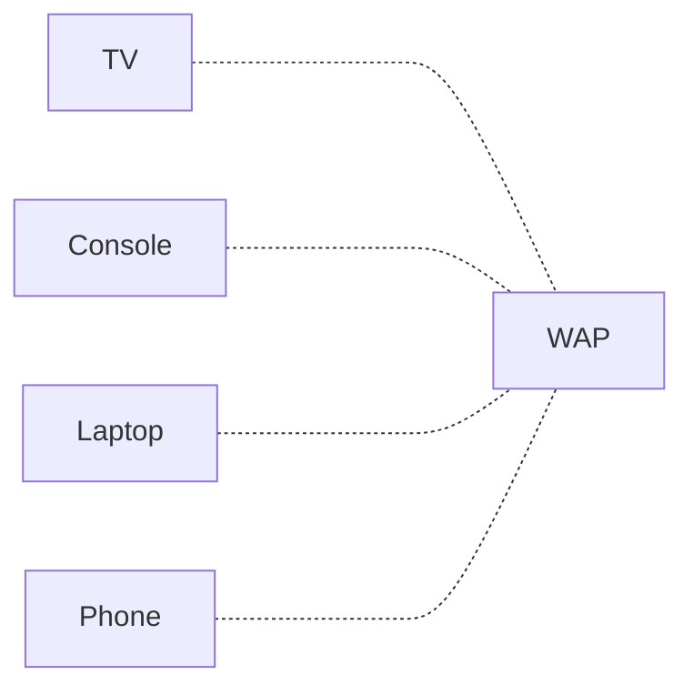
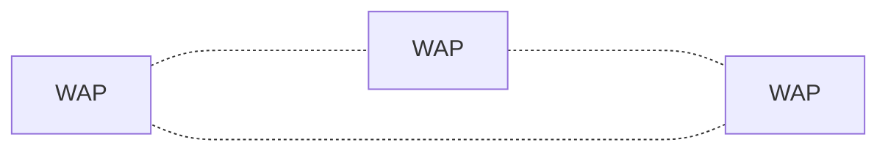

# Network
# Intro
Simplest computer network are two computers connected together and sharing resources.
It is composed by:
+ Physical Connection (wires, cables, wireless media)
+ Logical Connection (data transportation)

## Rules
+ Computers in a network must use the same communication protocol
+ Computers in a network must be able to know the source and destination of data

## Sizes of computer networks
+ PAN: Personal Area Network - Ex: Phone connected to Laptop through Bluetooth
+ LAN: Local Area Network - Ex: Home network with router. Laptop, Phone, PC, Printer
+ WLAN: Wireless Local Area Network - Ex: Home network but everything is wireless
+ CAN: Campus Area Network - Ex: School campus, business campus
+ MAN: Metropolitan Area Network - Ex: A city
+ WAN: Wide Area Network - Ex: Multiple cities / countries

# Architecture
## Peer-to-Peer
+ No dedicated servers
+ No centralized control
+ Devices can share resources freely
+ Computers can take roles of client or server

## Client-Server
+ Composed of client and server
	+ Servers provide resources
	+ Clients receive resources
+ Servers have centralized control over network resources
## Protocols
+ Physical Protocols describe the wiring, connections and signal
+ Logical Protocols describe how and when data is sent/received
	+ Web: HTTP
	+ Email: SMTP, IMAP
	+ File Transfers: FTP

# Models

## OSI
Not implemented in real world

| Data    | Layer        |
| ------- | ------------ |
| Data    | Application  |
| Data    | Presentation |
| Data    | Session      |
| Segment | Transport    |
| Packet  | Network      |
| Frame   | Data Link    |
| Bit     | Physical     |

## TCP/IP

| Layers            | Protocols            |
| ----------------- | -------------------- |
| Application       | FTP, HTTP, SMTP      |
| Transport         | TCP, UDP             |
| Internet          | IP, ARP              |
| Network Interface | Ethernet, Token Ring |

# Addresses

## MAC
Media Access Control

Physical address of network adaptor and each one has unique MAC
+ Part of OSI Layer 2
+ Part of TCP/IP Layer 1

$\underbrace{00-B0-D0}_{OUI} - \overbrace{63-C2-26}^{UAA}$

OUI: Organizationally Unique Identifier assigned by IEEE (ex: Dell)

UAA: Universally Administered Address. Unique for each device of an organization

Can check the organization through [lookup sites](https://dnschecker.org/mac-lookup.php)

## IP
Internet Protocol

Logical address of a device to uniquely identify it on an IP network
+ Part of OSI Layer 3
+ Part of TCP/IP Layer 2

# Communication

+ Full Duplex: Can send/receive data simultaneously 
+ Half Duplex: Can send/receive data, but not at the same time

# Network Transmission

+ Unicast: one-to-one communication
+ Multicast: one-to-many communication
+ Broadcast: one to everyone on the same network

# Topologies

+ Physical: defines where network devices are physically placed and how are connected to each other
+ Logical: defines how devices communicate with each other

### Wired Topology
#### Bus Topology
+ All devices are connected to a single coaxial network cable.
+ A single break in cable can take down the entire network.

#### Ring Topology

+ All devices are connected in circular fashion.
+ Data can travel unidirectional or bidirectional.
+ Each device in ring regenerates the signal acting as a repeater.
+ Failure of a node might take down the entire network

#### Star Topology

+ All devices are connected to a central connecting device (ex: switch)
+ Device sends data to the switch which sends the data to intended destination
+ Central device is a single point of failure

#### Mesh Topology

+ Each device is connected to each other
+ Types:
	+ Full Mesh
	+ Partial Mesh (some devices can miss redundant connections)

## Wireless Topology

### Ad hoc

+ Peer-to-Peer: devices communicate directly with each other

### Infrastructure

+ All devices connect to a wireless access point (WAP)

### Mesh

+ It utilizes multiple wireless access points to extend the range and make it more robust

# Networking devices

## NIC
Network Interface Card / Network Adapter

+ The network adaptor installed on a device
+ Examples:
	+ Connected through USB
	+ Connected through PCIe
	+ Build into motherboard

## Switch

+ Connects all devices together
+ Memorizes their MAC Address into MAC Address Table / Content Addressable Memory (CAM) Table
+ Sends data only towards destination instead of all devices connected
+ Breaks up collision domains
## WAP
Wireless Access Point
+ Extend the wired network towards wireless devices
+ It is not a router

## Wireless Range Extender

+ Connects to WAP and is acting as a wireless repeater to extend the range.
## Routers

+ Connects different networks together
+ Routes traffic between networks using IP Addresses
+ Breaks up a broadcast domains
## Modems

+ Modulates a signal to another (ex: analog -> digital)

## SOHO Device
All-in-One Small Office Home Office Device

+ Has expanded capabilities: Modem, Router, WAP, Firewall, Switch, DHCP Server, NAT Device, File Server...

## Media Converter

+ Converts one media type to another (ex: switch with ethernet cable towards server with fiber optic)
## Firewalls

+ Protects network from malicious activity
+ Prevents unwanted network traffic from accessing your network
+ Types:
	+ Network-based: hardware
	+ Host-based: software

## DHCP Server
Dynamic Host Configuration Protocol Server

+ Automatically assigns IP addresses to connected devices
+ Alternative to Static IP Address

## VoIP Endpoint
Voice over IP

+ Hardware devices or software that allows to make phone calls.

Resources to learn from:
+ https://skillsforall.com/
