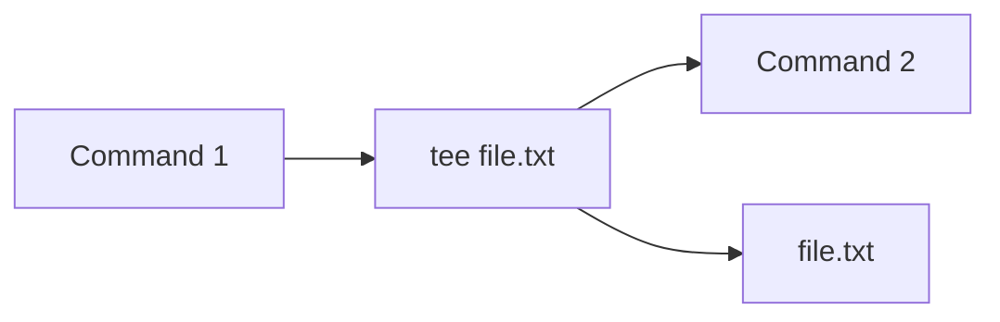

# Linux

# Introduction

### WIP

# Hotkeys
## General

| Hotkey       | Description               |
| ------------ | ------------------------- |
| `Ctrl+Alt+T` | Open Terminal             |
| `Ctrl+L`     | Jump few lines            |
| `Ctrl+C`     | Kill active process       |
| `Ctrl+K`     | Exit shell                |
| `Ctrl+Z`     | Put process in background |

## Navigation

| Hotkey   | Description             |
| -------- | ----------------------- |
| `Ctrl+A` | Go to the front of line |
| `Ctrl+E` | Go to the end of line   |
| `Alt+F`  | Go forward one word     |
| `Alt+B`  | Go back one word        |
## Command edit

| Hotkey          | Description            |
| --------------- | ---------------------- |
| `Ctrl+X Ctrl+E` | Open line in `$EDITOR` |

# Command structure

| Structure                   | Description                                      |
| --------------------------- | ------------------------------------------------ |
| `command options input`     |                                                  |
| `[ ]`                       | Optional                                         |
| `< >`                       | Mandatory                                        |
| `-a -b -c == -abc`          | Short form options can be linked together        |
| `--optionA --optionB`       | Long form options cannot be linked together      |
| `[-a \| -b]`                | One or the other. Cannot use both                |
| `...`                       | Can have multiple inputs                         |
|                             |                                                  |
| `0<` `<`                    | StdIn                                            |
| `1>` `1>>` `<` `<<`         | StdOut                                           |
| `2>` `2>>`                  | StdError                                         |
| `&>`                        | Redirect both StdIn and StdOut                   |
| `command1 \| command2`      | Pipe the StdOut of command1 to StdIn of command2 |
|                             |                                                  |
| `command \| xargs command2` | Converts stdout into command line arguments      |

## T pipe

Tee is used to redirect an output towards two inputs.

```bash
# .bash_aliases
# A command that can be called by its custom name
alias custom_command='standard_command_1 | standard_command_2 | tee output.txt | standard_command_3'
# Std output of one command can be piped into custom_with_input command
alias custom_with_input='xargs standard_command > file.txt'
```



## Wildcards

| Wildcards      | Description                                              |
| -------------- | -------------------------------------------------------- |
| `*`            | Matches anything                                         |
| `?`            | Matches anything for only 1 character                    |
| `[]`           | Matches the options inside for only 1 character          |
| `[1-9]`        | Matches any number from 1 to 9 for only 1 character      |
| `{}`           | [領域展開](https://youtu.be/x9EI1aLFfAo)                     |
| `{2019..2024}` | Expands what it is inside. All numbers from 2019 to 2024 |
| `{1,2}_{A,B}`  | Combinations. Will have 4 results                        |

## Useful commands

| Command                   | Description                                                        |
| ------------------------- | ------------------------------------------------------------------ |
| `find`                    | Searches files and directories without a database                  |
| `cat`                     | Print and concatenate files                                        |
| `grep <text> <file/text>` | Searches `text` in `file/text`                                     |
| `locate`                  | Print files and directories according to the search using database |
| `updatedb`                | Update database for `locate` manually                              |
| `file`                    | Check the type of a file                                           |
| `which [command]`         | Locate command                                                     |

## Scheduling
| Command                                              | Description                                          |
| ---------------------------------------------------- | ---------------------------------------------------- |
| `crontab -e`                                         | Schedule tasks                                       |
| `minute hour day_of_month month day_of_week command` |                                                      |
| `*`                                                  | * For anything. Other wildcards will not work        |
| `0,15,30,45`                                         | Example that it will run for each mentioned minute   |
| `*/[number]`                                         | Run every `number` minute                            |
| `month` `* or number or ex:JAN`                      |                                                      |
| `day_of_week` `* or number or ex:MON`                | More details at [Crontab.guru](https://crontab.guru) |

## Archiving

| Command                          | Description                                                                    |
| -------------------------------- | ------------------------------------------------------------------------------ |
| `tar -cvf [name].tar [files]...` | Create preparation archive with the name and files mentioned and output result |
| `tar -xvf [tarfile]`             | Extract the files                                                              |
| `gzip [name].tar`                | Archives file (fast but bigger size) - better on multiple small files          |
| `gunzip [name].tar.gz`           | Unarchive                                                                      |
| `bzip2 [name].tar`               | Archives file (slower but lower size) - better on large files                  |
| `bunzip2 [name].tar.bz2`         | Unarchive                                                                      |
| `zip [name].zip [files]...`      | Create zip                                                                     |
| `unzip [archive].zip`            | Unarchive                                                                      |

## File Permissions

$$\underbrace{-}_{Begin}\underbrace{---}_{Owner:rwx}\,\underbrace{---}_{Group:rwx}\,\underbrace{---}_{Others:rwx}$$
Begin:
+ regular file: `-`
+ directory: `d`
+ symbolic-link: `l`

Groups:
+ User: `u`
+ Group: `g`
+ Others: `o`

Permissions:
+ Read(`r`) = `4`
+ Write(`w`) = `2`
+ Execute(`x`) = `1`

Examples:
`chmod 755 filename`=> Owner(`4`+`2`+`1`)=full access, Group and Others(`1`+`4`)=`read and execute`
It is the same thing as:
`chmod u+rwx,g+rx,o+rx filename`
