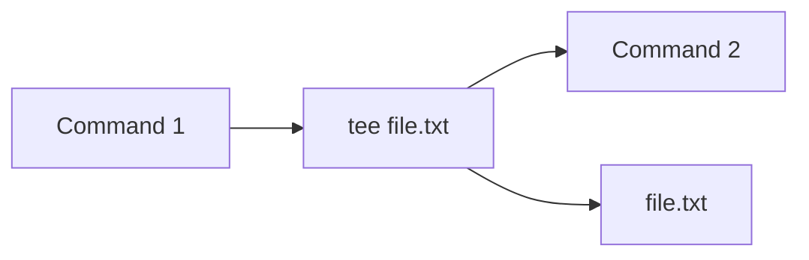
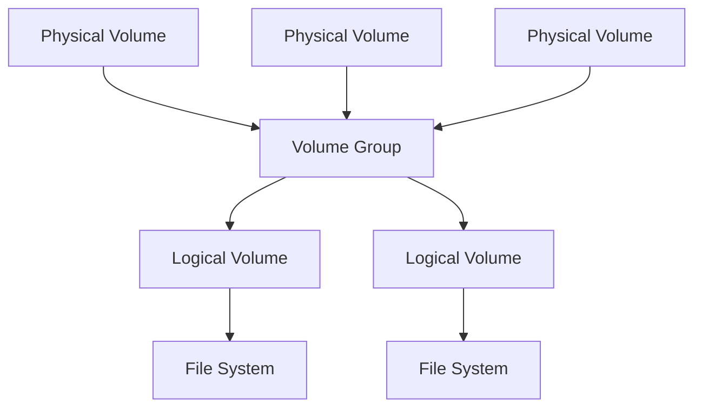

# Linux
# Introduction

### WIP

# Hotkeys
## General

| Hotkey       | Description               |
| ------------ | ------------------------- |
| `Ctrl+Alt+T` | Open Terminal             |
| `Ctrl+L`     | Jump few lines            |
| `Ctrl+C`     | Kill active process       |
| `Ctrl+K`     | Exit shell                |
| `Ctrl+Z`     | Put process in background |

| Hotkey        | Description           |
| ------------- | --------------------- |
| `Ctrl+U`      | Clear up to beginning |
| `Ctrl+K`      | Clear to the end      |
| `Ctrl+Y`      | Revert                |
| `Ctrl+W`      | Delete 1 word         |
| `Alt+Shift+#` | Comment the line      |

## Navigation

| Hotkey   | Description             |
| -------- | ----------------------- |
| `Ctrl+A` | Go to the front of line |
| `Ctrl+E` | Go to the end of line   |
| `Alt+F`  | Go forward one word     |
| `Alt+B`  | Go back one word        |
## Command edit

| Hotkey          | Description            |
| --------------- | ---------------------- |
| `Ctrl+X Ctrl+E` | Open line in `$EDITOR` |

# Command structure

| Structure                   | Description                                                     |
| --------------------------- | --------------------------------------------------------------- |
| `command options input`     |                                                                 |
| `[ ]`                       | Optional                                                        |
| `< >`                       | Mandatory                                                       |
| `-a -b -c` == `-abc`        | Short form options can be linked together                       |
| `--optionA --optionB`       | Long form options cannot be linked together                     |
| `[-a \| -b]`                | One or the other. Cannot use both                               |
| `...`                       | Can have multiple inputs                                        |
|                             |                                                                 |
| `0<` `<`                    | StdIn                                                           |
| `1>` `1>>`                  | StdOut                                                          |
| `2>` `2>>`                  | StdError                                                        |
| `&>`                        | Redirect both StdIn and StdOut                                  |
| `&?`                        | Get exit status                                                 |
| `<< <text>`                 | The script will stop when it encounters `text`<br>Here Document |
| `<<< <string>`              | Redirect input of string<br>Here String                         |
|                             |                                                                 |
| `command1 \| command2`      | Pipe the StdOut of command1 to StdIn of command2                |
|                             |                                                                 |
| `command \| xargs command2` | Converts stdout into command line arguments                     |

## T pipe

Tee is used to redirect an output towards two inputs.

```bash
# .bash_aliases
# A command that can be called by its custom name
alias custom_command='standard_command_1 | standard_command_2 | tee output.txt | standard_command_3'
# Std output of one command can be piped into custom_with_input command
alias custom_with_input='xargs standard_command > file.txt'
```



## Wildcards

| Wildcards      | Description                                              |
| -------------- | -------------------------------------------------------- |
| `*`            | Matches anything                                         |
| `?`            | Matches anything for only 1 character                    |
| `[]`           | Matches the options inside for only 1 character          |
| `[1-9]`        | Matches any number from 1 to 9 for only 1 character      |
| `{}`           | Expand/Go through list                                   |
| `{2019..2024}` | Expands what it is inside. All numbers from 2019 to 2024 |
| `{1,2}_{A,B}`  | Combinations. Will have 4 results                        |

## Useful commands

| Command                    | Description                                                                                                         |
| -------------------------- | ------------------------------------------------------------------------------------------------------------------- |
| `find`                     | Searches files and directories without a database                                                                   |
| `cat`                      | Print and concatenate files                                                                                         |
| `grep <text> <file/text>`  | Searches `text` in `file/text`                                                                                      |
| `locate`                   | Print files and directories according to the search using database                                                  |
| `updatedb`                 | Update database for `locate` manually                                                                               |
| `file`                     | Check the type of a file                                                                                            |
| `which [command]`          | Locate command                                                                                                      |
| `source [script]`          | Run script in the base shell instead of subshell                                                                    |
| `bc`                       | Enter math script                                                                                                   |
| `cut`                      | Prints selected parts of the lines from files                                                                       |
| `apropos [name]`           | Use partial `name` to find command or its description from manual                                                   |
| `whatis [command]`         | See description of `command`                                                                                        |
| `compgen -c [command]`     | Same as `apropos`, but searches only for command name                                                               |
| `wc`                       | Get line, word, character count                                                                                     |
| `sudo apt purge <package>` | Uninstalls and removes configuration files for `package`<br>If want to keep configs use `remove` instead of `purge` |

## Monitoring

| Command          | Description                        |
| ---------------- | ---------------------------------- |
| `df`             | Display disk space                 |
| `du`             | Display disk occupied by files     |
| `free`           | Display RAM status                 |
| `top`            | Task manager. Press h for commands |
| `ps`             | List running processes             |
| `lsblk`          | Display mounts                     |
| `cat /etc/fstab` | Display automatic mounts at boot   |
| `netstat -tulpn` | Display network connections        |

## Scheduling
| Command                                              | Description                                          |
| ---------------------------------------------------- | ---------------------------------------------------- |
| `crontab -e`                                         | Schedule tasks                                       |
| `minute hour day_of_month month day_of_week command` |                                                      |
| `*`                                                  | * For anything. Other wildcards will not work        |
| `0,15,30,45`                                         | Example that it will run for each mentioned minute   |
| `*/[number]`                                         | Run every `number` minute                            |
| `month` `* or number or ex:JAN`                      |                                                      |
| `day_of_week` `* or number or ex:MON`                | More details at [Crontab.guru](https://crontab.guru) |

## Archiving

| Command                          | Description                                                                    |
| -------------------------------- | ------------------------------------------------------------------------------ |
| `tar -cvf [name].tar [files]...` | Create preparation archive with the name and files mentioned and output result |
| `tar -xvf [tarfile]`             | Extract the files                                                              |
| `gzip [name].tar`                | Archives file (fast but bigger size) - better on multiple small files          |
| `gunzip [name].tar.gz`           | Unarchive                                                                      |
| `bzip2 [name].tar`               | Archives file (slower but lower size) - better on large files                  |
| `bunzip2 [name].tar.bz2`         | Unarchive                                                                      |
| `zip [name].zip [files]...`      | Create zip                                                                     |
| `unzip [archive].zip`            | Unarchive                                                                      |

## Permissions

Print details: `ls -l`

$\underbrace{-}\_{\text{First}}\,\underbrace{---}\_{\text{Owner:rwx}}\,\underbrace{---}\_{\text{Group:rwx}}\,\underbrace{---}\_{\text{Others:rwx}}, user, group$


First:
+ regular file: `-`
+ directory: `d`
+ symbolic-link: `l`

Groups:
+ User: `u`
+ Group: `g`
+ Others: `o`

Permissions:
+ Read(`r`) = `4`
+ Write(`w`) = `2`
+ Execute(`x`) = `1`

Examples:
- `chmod 755 filename`=> Owner(`4`+`2`+`1`)=full access, Group and Others(`1`+`4`)=`read and execute`
- It is the same thing as: `chmod u+rwx,g+rx,o+rx filename`

### Owners
Single owner: `chown username:groupname /path/to/file`
- UserName/GroupName can be left empty if not needed
	- `chown :mygroup /path/to/file`
	- `chown myuser /path/to/file`

Multiple owners:
- Add group: `setfacl -m g:groupx:rw filename`
- Add user: `setfacl -m u:username:rw filename`
- Remove group: `setfacl -x g:groupx filename`
- Remove ACL: `setfacl -b filename`
- Print owners: `getfacl filename`

### Users
- Create user: `adduser username`
- Delete user: `deluser --remove-home username`
### Groups
- View all groups: `groups`
- View all groups for a specific user: `groups username`
- View all users for a  specific group: `getent group groupname`
- Create group: `groupadd groupname`
- Delete group: `groupdel groupname`
- Add user to group: `usermod -aG groupname username`
- Remove user from group: `gpasswd -d username groupname`

## Mount

| Command                     | Description                                                           |
| --------------------------- | --------------------------------------------------------------------- |
| `lsblk`                     | Display mounts                                                        |
| `lvmdiskscan`               | All block devices LVM can interact with will have LVM text at the end |
| `fdisk`                     | Partition the disk                                                    |
| `pvs`                       | Display all LVM PVs (Physical Volumes) and the VG they are part of    |
| `vgs`                       | Display all VGs (Volume Groups)                                       |
| `vgs -o +lv_size,lv_volume` | Display  all logical volumes and the relationship with volume group   |
| `lvs`                       | Display all LVs (Logical Volumes)                                     |

### LVM (Logical Volume Manager)



### Add/Modify

| Command                                           | Description                                                       |
| ------------------------------------------------- | ----------------------------------------------------------------- |
| `mount /dev/VGname/LVname /mnt/LVname`            | Mount LV to point                                                 |
| `pvcreate /dev/DiskName[n]`                       | Initialize physical volume disks                                  |
| `pvmove /dev/source /dev/destination`             | Move LVM data. Destination is optional                            |
| `vgcreate VGname /dev/DiskName[n]`                | Create VG and add volumes                                         |
| `vgextend VGname /dev/DiskName`                   | Extend existing VG                                                |
| `lvcreate -L [size][unit] -n LVname VGname`       | Create a logical volume (ex: `lvcreate -L 50m -n workspace myVG`) |
| `lvcreate -l 100%FREE -n name VGname`             | Create logical volume with all the free space in VG               |
| `lvextend -r -L +[size][unit] /dev/VGname/LVname` | Extend existing LV                                                |
| `lvextend -r -l +100%FREE /dev/VGname/LVname`     | Extend existing LV with all free space                            |
| `mkfs.[format] /dev/VGname/LVname`                | Format volume (ex: mkfs.ext4)                                     |
| `mkdir -p /mnt/LVname`                            | Create mount point for LV                                         |

### Remove

| Command                                       | Description                  |
| --------------------------------------------- | ---------------------------- |
| `umount /mnt/LVname`                          | Unmount                      |
| `e2fsck -f /dev/VGname/LVname`                | Check filesystem             |
| `resize2fs /dev/VGname/LVname [size][unit]`   | Resize disk to specific size |
| `lvreduce -L [size][unit] /dev/VGname/LVname` | Resize LV to specific size   |
| `lvremove /dev/VGname/LVname`                 | Remove LV                    |
| `vgreduce VGname /dev/DiskName`               | Remove disk from VG          |
| `pvremove /dev/DiskName`                      | Remove PV metadata from disk |